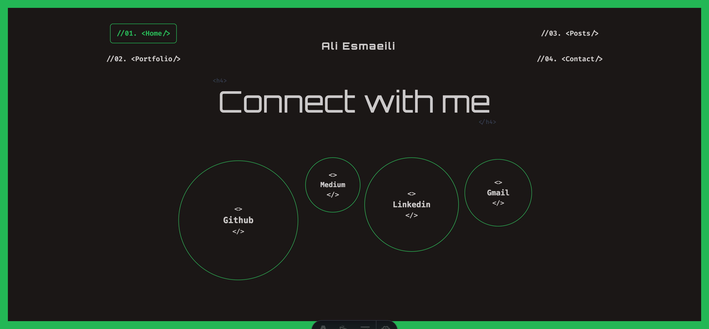

# Aliespire

**Project Description:**
Aliespire is a project based on Astro, utilizing Tailwind CSS and DaisyUI for UI design.

**Installation Instructions:**

1. Ensure that Node.js and Yarn are installed on your system.
2. Run the following command to install dependencies:
   ```bash
   yarn
   ```
3. To run the project in development mode, execute:
   ```bash
   yarn dev
   ```
4. To build the project for production, use:
   ```bash
   yarn build
   ```

**Dependencies:**

- `@tailwindcss/vite`: ^4.1.8
- `astro`: ^5.9.0
- `daisyui`: ^5.0.43
- `tailwindcss`: ^4.1.8

**Screenshots:**

